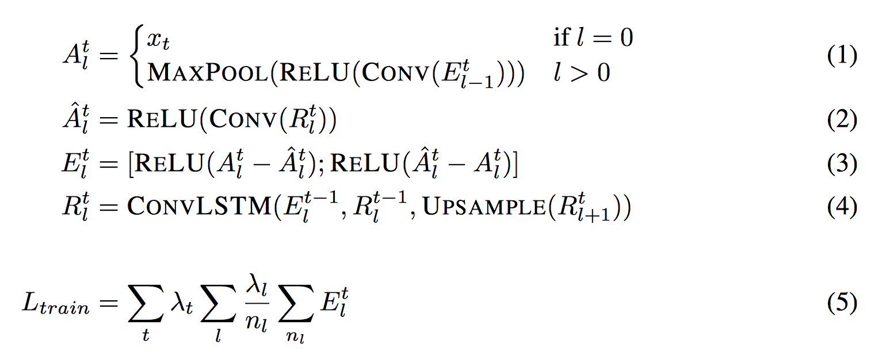
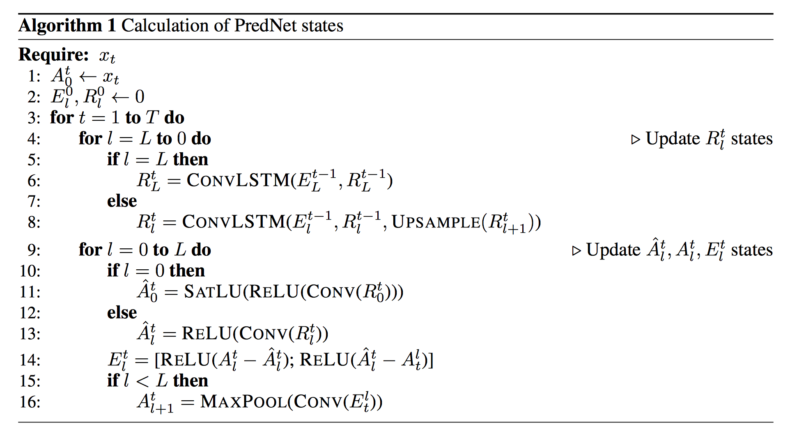

# Deep Predictive Coding for Multimodal Representation Learning

## Abstract

This project focuses on the use o Deep Predictive Coding models as a more principled approach for representation learning on videos. We evaluate the quality of learned representations on supervised problems, including action recognition and language understanding using multimodal aligned information of video, audio, and text.

## Introduction

Deep Predictive Coding networks (PredNets), inspired by the "predictive coding" literature from neuroscience ([Friston, 2009](#friston)), frame the unsupervised learning problem as the capacity of predicting future sensory data in a sequence. These networks can predict complex object movements in synthetic and natural videos, resulting in learned representations that are useful for estimating latent variables like steering angle in an autonomous vehicle setting ([Lotter, 2016](#lotter)).

Given this successful application on videos, we hypothesise that **representations learned using the predictive coding approach could lead to better performance in multimodal tasks involving videos**, such as cross-modal retrieval ([Aytar, 2017](#aytar)), grounded language learning ([Hermann, 2017](#hermann)), and action/event recognition in videos ([Monfort, 2017](#monfort)). Many of the models used in these tasks use a naive approach to extract features from videos, using the last layer of pre-trained image classifiers. To illustrate this point, we show the architecture of the Whodunnit model ([Frermann, 2017](#frermann)):

In the above case, the image features are merely the last layer of an Inception-v4 convolutional network pre-trained on an object classification task. We believe that PredNets could perform better in this task because they are specifically designed to handle temporal data and, most importantly, they can be trained in an unsupervised way on cheaply available unlabeled video datasets.

## Deep Predictive Coding model

For details refer to [Lotter, 2016](#lotter), Section 2. A reference implementation is provided [here](https://github.com/coxlab/prednet).

## References

##### Friston
Friston, K., & Kiebel, S. (2009). Predictive coding under the free-energy principle. Philosophical Transactions of the Royal Society B: Biological Sciences, 364(1521), 1211-1221.

##### Lotter
Lotter, W., Kreiman, G., & Cox, D. (2016). [Deep predictive coding networks for video prediction and unsupervised learning](https://arxiv.org/abs/1605.08104). arXiv preprint arXiv:1605.08104.

##### Frermann
Frermann, L., Cohen, S. B., & Lapata, M. (2017). Whodunnit? Crime Drama as a Case for Natural Language Understanding. arXiv preprint arXiv:1710.11601.

##### Hermann
Hermann, K. M., Hill, F., Green, S., Wang, F., Faulkner, R., Soyer, H., ... & Wainwright, M. (2017). Grounded language learning in a simulated 3D world. arXiv preprint arXiv:1706.06551.

##### Monfort
Monfort, M., Zhou, B., Bargal, S. A., Andonian, A., Yan, T., Ramakrishnan, K., ... & Oliva, A. (2018). Moments in Time Dataset: one million videos for event understanding. arXiv preprint arXiv:1801.03150.

##### Aytar
Aytar, Y., Vondrick, C., & Torralba, A. (2017). See, hear, and read: Deep aligned representations. arXiv preprint arXiv:1706.00932.
