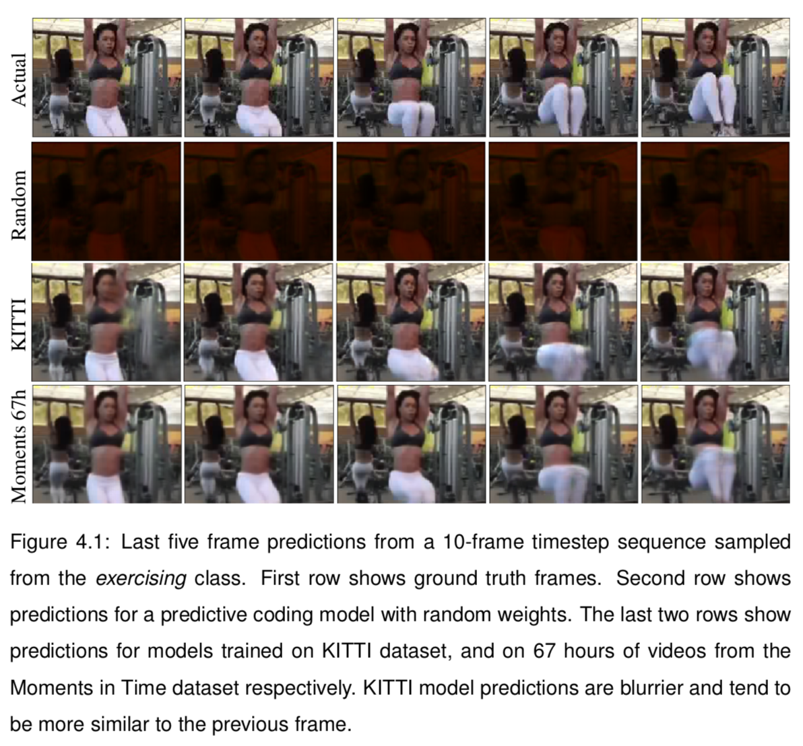

# Deep Predictive Coding for Multimodal Representation Learning

## Abstract

In machine learning parlance, common sense reasoning relates to the capacity of _learning representations_ that disentangle hidden factors behind spatiotemporal sensory data. In this work, we hypothesise that the predictive coding theory of perception and learning from neuroscience literature may be a good candidate for implementing such common sense inductive biases. We build upon a previous deep learning implementation of predictive coding by [Lotter et al. (2016)](#lotter) and extend its application to the challenging task of inferring abstract, everyday human actions such as _cooking_ and _diving_. Furthermore, we propose a novel application of the same architecture to process auditory data, and find that with a simple sensory substitution trick, the predictive coding model can learning useful representations. Our transfer learning experiments also demonstrate good generalisation of learned representations on the UCF-101 action classification dataset.

## Research questions

To investigate the design of machines that acquire common sense by observing the world, we capitalise on a deep learning implementation of the predictive coding model published by [Lotter et al. (2016)](#lotter). Their deep predictive coding network was shown to learn representations that disentangle latent variables correlated to the movement of objects in synthetic and natural images. We extend their study to address the following questions:
* Can unsupervised predictive coding models learn higher-level spatiotemporal concepts, namely quotidian activities such as _driving_ or _exercising_?
* Are predictive coding inductive biases general enough so that these models can also learn from auditory information?
* What are the limitations of the deep predictive coding implementation with respect to the original neuroscience theory proposed by [Friston and Kiebel (2009)](#friston) and [Rao and Ballard (1999)](#rao)?

## Contributions

Our main contributions are summarised as follows:

* Based on a theoretical review of the free-energy principle [(Friston, 2010)](#friston_), we analyse some of the architectural limitations of [Lotter et al. (2016)](#lotter) deep learning implementation, in particular, regarding the inference of hidden causes via free energy minimisation.
* We extend the work of [Lotter et al. (2016)](#lotter) by using predictive coding representations to decode higher-level concepts that require the understanding of world dynamics. The learned representations are evaluated on small-scale tasks and on UCF-101 [(Soomro et al., 2012)](#soomro), a popular action recognition benchmark.
* We train the predictive coding model on a dataset about 60 times larger than the one used in previous work ([Lotter et al., 2016](#lotter)) and show that model continues to improve future frame predictions, even when the training dataset includes a large number of unrelated classes.

  

* Inspired by sensory substitution literature from neuroscience [(Stiles and Shimojo, 2015)](#stiles), a novel application of the predictive coding model is proposed for unsupervised representation learning from audio data. Our results suggest that the different modalities provide complementary information that is useful for the action classification task.

## Relevant documents
* [Project proposal](./informatics-project-proposal.pdf)
* [Project progress report](./project-progress-report.pdf)
* [Latest dissertation version](https://github.com/thefonseca/msc-project/raw/master/dissertation.pdf)

## Project folders
* [datasets](./datasets): includes scripts for downloading and preprocessing of the datasets used in the experiments, including the Moments in Time and UCF-101 datasets.
* [models/prednet](./models/prednet): the primary model implementation for our study. The model code is adapted from the implementation provided by [Lotter, 2016](#lotter). All the pipeline was reimplemented to fit our experimental needs.
* [models/classifier](./models/classifier): implementation of simple SVM and LSTM classifiers used on top of predictive coding representations.

## References

##### Friston
Friston, K., & Kiebel, S. (2009). [Predictive coding under the free-energy principle](http://rstb.royalsocietypublishing.org/content/364/1521/1211). Philosophical Transactions of the Royal Society B: Biological Sciences, 364(1521), 1211-1221.

##### Friston_
Friston, K. (2010). The free-energy principle: a unified brain theory? Nature Reviews Neuroscience, 11(2):127.

##### Lotter
Lotter, W., Kreiman, G., & Cox, D. (2016). [Deep predictive coding networks for video prediction and unsupervised learning](https://arxiv.org/abs/1605.08104). arXiv preprint arXiv:1605.08104.

##### Monfort
Monfort, M., Zhou, B., Bargal, S. A., Andonian, A., Yan, T., Ramakrishnan, K., ... & Oliva, A. (2018). [Moments in Time Dataset: one million videos for event understanding](https://arxiv.org/abs/1801.03150). arXiv preprint arXiv:1801.03150.

##### Rao
Rao, R. P. and Ballard, D. H. (1999). Predictive coding in the visual cortex: a functional interpretation of some extra-classical receptive-field effects. Nature neuroscience, 2(1):79.

##### Soomro
Soomro, K., Zamir, A. R., and Shah, M. (2012). Ucf101: A dataset of 101 human actions classes from videos in the wild. arXiv preprint arXiv:1212.0402.

##### Stiles
Stiles, N. R. and Shimojo, S. (2015). Auditory sensory substitution is intuitive and automatic with texture stimuli. Scientific reports, 5:15628.
